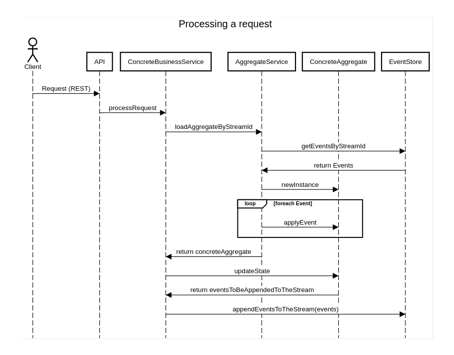

# Codelity Event Sourcing Library 
is a lightweight container friendly library which will utilise **[event sourcing](https://microservices.io/patterns/data/event-sourcing.html)** pattern to write loosely coupled, scalable microservices in Java.

### Design
Initial project will have five modules. 
1. **Common** : A shared library which contains Annotations, Interfaces etc.
2. **Core** : The core library which contains core components such as AggregateService, EventHandlingContext etc. 
3. Spring auto-configuration for Core Module
4. **JDBCEventStore**: JDBC implementation of EventStore.
5. Spring auto-configuration for JDBCEventStore module

The following sequence diagram shows how a request will be handled.



The EventStore component will be an adapter which can be implemented in different technologies and techniques (polling, change data capture etc). 
The EventStore will be responsible for publishing and consuming events in sequential order. The MVP will contain **JDBC** implementation of EventStore which uses **Postgres**. 

Separate modules will be developed to work with different frameworks such as **SpringBoot**, **Micronaut**, **Quarkus** etc. The MVP will only contain SpringBoot auto-configuration.

@EventSourcingEnabled, @Event, @AggregateMethod and @EventHandler annotations will be used to make the configuration easier.

An example SpringBootApplication configuration:   

``` java
@SpringBootApplication
@EventSourcingEnabled
public class Application {

	public static void main(String[] args) {
		SpringApplication.run(Application.class, args);
	}
	
}
```

Event example: 
``` java
@Event(name="orderservice.order-created")
public class OrderCreatedEvent {
}
```

Aggregate example: 
``` java

public class Order {

    @AggregateMethod
    public void handleOrderCreated(OrderCreatedEvent event) {
    }
    
    public List<Object> createOrder(Order order) {
        return Collections.singletonList(new OrderCreatedEvent(product));
    }
    
}
```

EventListener example: 
``` java

public class OrderEventListener {

    @EventHandler
    public void handleOrderCreated(OrderCreatedEvent event) {
        repository.save(event.getOrder());
    }
    
}
```

### JDBCEventStore implementation

This eventstore will store events in Postgres by default, at least in the MVP. There will be an event table to store events and a delivery table to store delivery queue.  
To deliver messages to event listeners, this delivery queue will be consumed regularly by workers. Worker parameters will be set in application.yaml file.

Parameters: Worker count, polling interval, polling item count, max retry count, retry interval. 

### MVP scope:

Snapshots, Event Replay won't be in the MVP.
